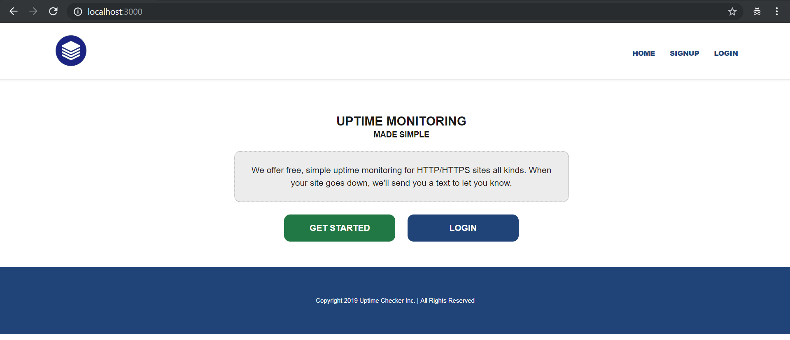
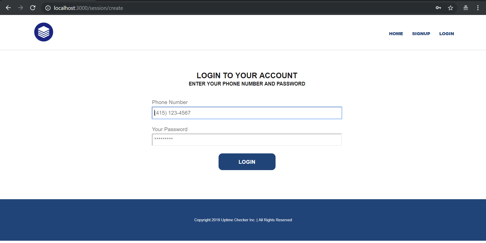
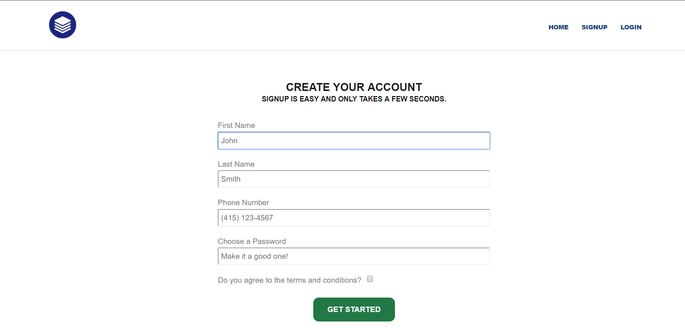
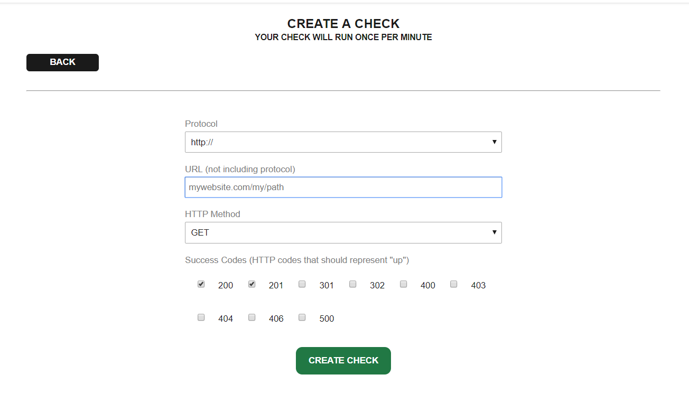
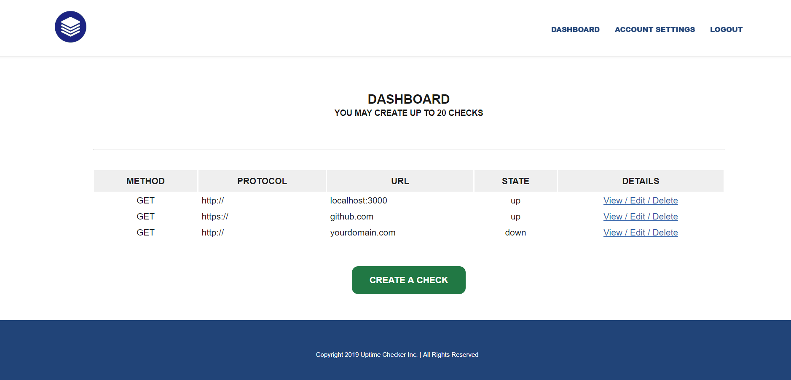
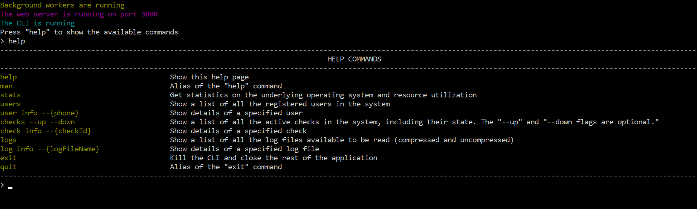

# UPTIME CHECKER

Free uptime checker for your websites using Node.js

## USE

You can clone this repository and start the application on your local server using:
```bash
node index.js
```

No Frameworks, No NPM, No Dependencies. Backend: Just Node.js

[Check it out at your localhost](http://localhost:3000).

## SCREENSHOTS













### ENJOY ;-)
